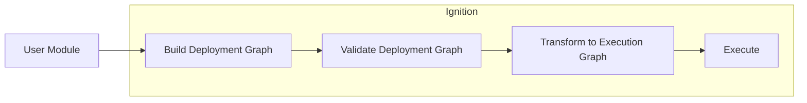
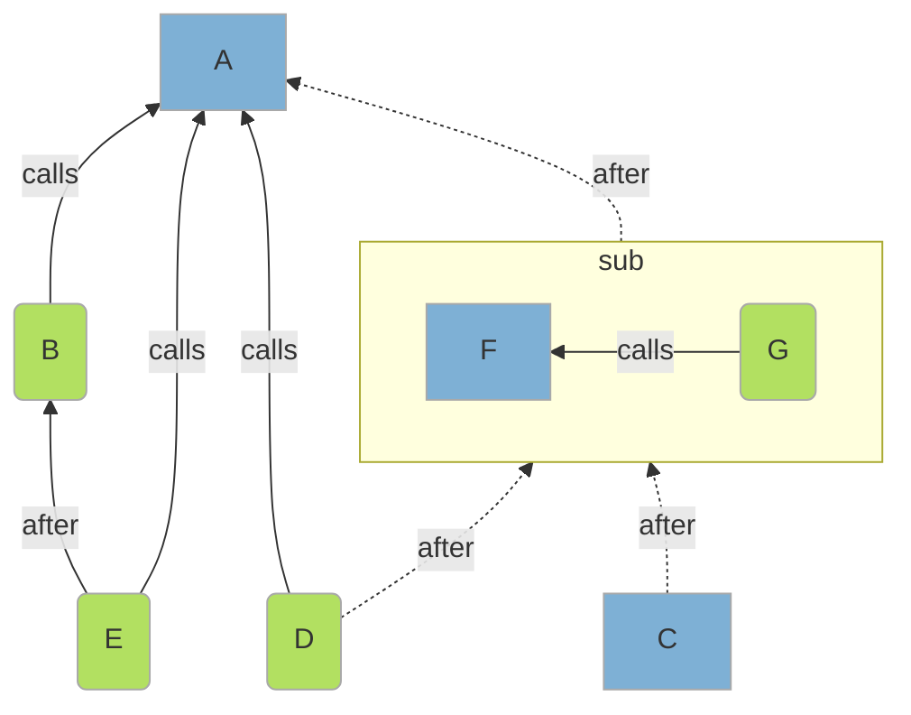
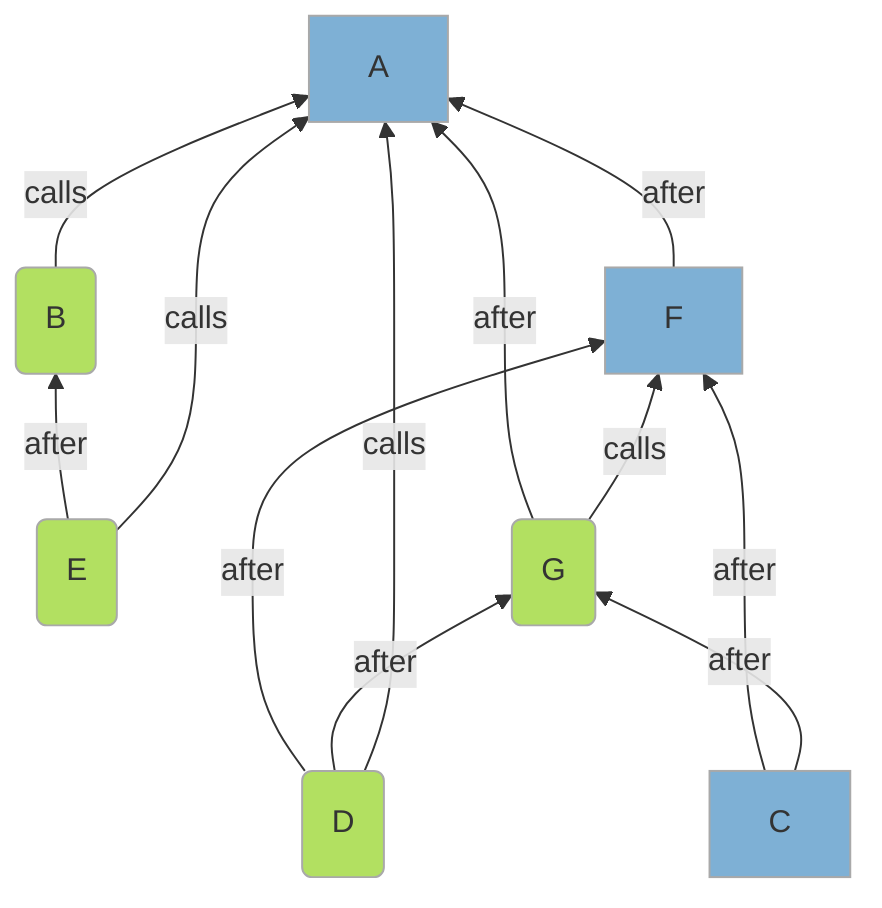
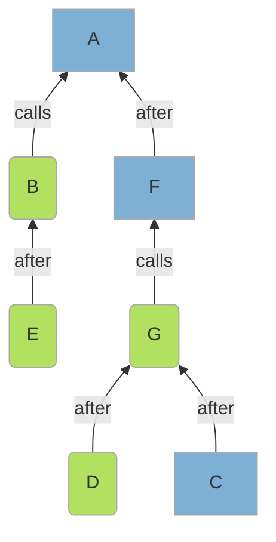
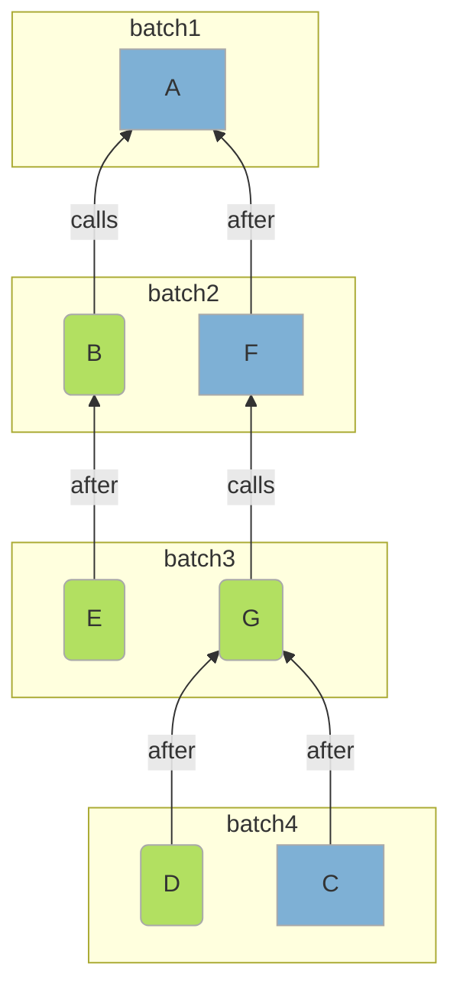

# Design

## Overview

Ignition allows users to describe complex deployments and execute them on-chain.



Ignition expresses a deployment as a dependency graph of on-chain transactions, that is, contract deployments and contract calls. Deployments and calls can be dependent on each other. A call to a contract requires that that contract first be deployed; the call should not be invoked until the contract deploy has completed entirely and successfully.

Ignition provides the **deployment api** (a js based dsl) so users can succintly describe a dependency graph of contract deploys and calls.

To deploy on-chain Ignition takes a `Module` specified via the **deployment api** and constructs the `ExecutionGraph` (the depenency graph of on-chain transactions). The final generation of the `ExecutionGraph` is a multi-step process of construction, validation and simplification that leverages a temporary intermediary representation (the `DeploymentGraph`).

The `ExecutionGraph` is passed to the execution engine which submits the transactions on-chain, ordering them and batching them based on the dependency constraints of the `ExecutionGraph`.

## Building an `ExecutionGraph` from a Module

The user describes the dependency graph as a `Module`, a utility function that takes a graph builder as its first argument. The user can express the on-chain transactions and their dependencies by calls on the graph builder.

```javascript
const subgraph = buildSubgraph("Subgraph", (m) => {
  const f = m.contract("F");

  m.call(f, "G");

  return { f };
});

module.exports = buildModule("Example", (m) => {
  const a = m.contract("A");

  const bCall = m.call(a, "B");

  m.call(a, "E", {
    after: [bCall],
  });

  const { subgraph: sub } = m.useSubgraph(subgraph, {
    after: [a],
  });

  m.call(a, "D", {
    after: [sub],
  });

  m.contract("C", {
    after: [sub],
  });

  return { a };
});
```

Ignition uses the `Module` to construct a `DeploymentGraph`. The `DeploymentGraph` matches closely with the high level **api** and contains constructs that are **Hardhat** specific (i.e. "Deploy the 'A' Hardhat contract").



During construction of the `DeploymentGraph`, subgraphs are collapsed down to a single level. A vertex that depends on subgraph, is altered to depend on all the vertexes of a subgraph. Similarly the vertexes of a subgraph are altered to depend on all the dependencies of that subgraph.



This `DeploymentGraph` is validated (i.e. are all named hardhat contracts within the hardhat project; do all the calls have the right number of arguments etc). The validation attempts to ensure the `DeploymentGraph` can be transformed into an `ExecutionGraph` without error and to reduce the chance of an on-chain errors during execution. Validation checks do not take into account on-chain state, only enforcing that the deployment makes sense internally.

A valid `DeploymentGraph` is then reduced to remove unnecessary edges (**NOTE: currently only a partial reduction, to remove subgraph virtual nodes**).



The reduced `DeploymentGraph` will contain lots of **Hardhat** specific references. Ignition transforms the `DeploymentGraph` into an `ExecutionGraph` that is designed for use by the execution engine without any reference to **Hardhat**. The edge structure is copied across but each **Hardhat** specific vertex (an on-chain transaction) is translated into an agnostic equivalent. For instance, a deploy hardhat contract `Foo` instruction, will be transformed by reading the **Hardhat** artifact for `Foo` and passing along an agnostic `Deploy this artifact` instruction.

Validated, simplified and converted to the agnostic `ExecutionGraph` representation, the execution engine can now run the deployment.

## Execution

The execution engine is responsible for submitting transactions to the blockchain. It takes the `ExecutionGraph` as input and uses the vertexes to determine which transactions should be sent, and uses the edges to determine how the transactions are ordered and batched.

More than one transaction can be submitted to the Ethereum chain at once. A **depenency** in this context means that the previous transaction must have completed successfully on chain before the dependent transaction can be submitted.

To simplify user reasoning about the order of execution, the execution engine groups into batches. A batch is the next set of transactions to submit. Batches are submitted until there is an error or all transactions are complete.

```javascript
let unstarted = getVertexesFrom(executionGraph);
let onHold = [];
let errors = [];
let completed = [];

let buildBatch = (unstarted, completed) =>
  unstarted.filter((v) =>
    allDependenciesCompleted(v, executionGraph, completed)
  );

while (unstarted.length > 0) {
  const batch = buildBatch(unstarted.concat(onHold), completed);

  const {
    errors: batchErrors,
    completed: batchCompleted,
    onhold: batchOnhold,
  } = await executeBatch(batch);

  onHold = batchOnHold;
  removeFrom(unstarted, batchCompleted);
  addTo(completed, batchCompleted);

  addTo(errors, batchErrors);
  if (errors.length > 0) {
    break;
  }
}
```

A batch is constructed by looking at all unstarted or on-hold vertexes and using the `ExecutionGraph` to determine if all there dependencies have been met (executed successfully).

The execution engine will wait until all the transactions in a batch have completed or failed or been designated on-hold or timed out. Once the batch is complete, either the deployment finishes as complete because because all transactions are complete, as error because there was an error, as on-hold because there was an on-hold result but no errors or timeouts.

A policy governs how to deal with timed-out transactions. By default if an timed-out transaction fails to complete `x` times (once per batch) it becomes a failure.

Either the entire graph of transactions will eventually succeed, in which case the deployment was a success. Or a transaction will fail or be stopped from completing, leading to a failed deployment.

It follows from this that different runs of the same deployment (`ExecutionGraph`) may lead to different batchings. But assuming each transaction completes on the first attempt, the example above would give a batching like the following:


