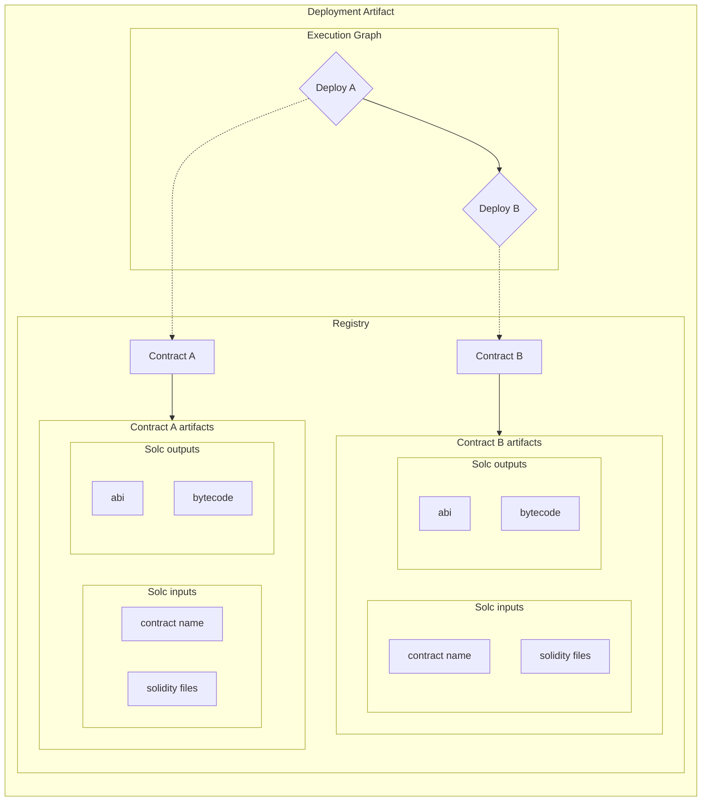

# Distributable Deployments

Ignition is intended to allow packaging and distribution of deployment logic. The goal is:

- the composing of deployment logic to create complex systems
- to allow the distribution of complex contract systems for local testing
- to allow third parties to easily use your deployed contracts and accompanying deployment logic in their own deployment
- multi-targeting of different chains
- deployments should be verifiable
- Deployed contracts should be usable with frontend development frameworks through typescript types

A verifiable deployment is one where:

- every internal contract deploy can show the providence of the underlying bytecode back to the source code and constructor args
- every used or depended on external contract is known and has providence
- the external contract code used in the internal contract code matches the code in the external contracts providence

Demonstrating the providence of bytecode (whether deployed or ready to deploy) means reproducing the bytecode from source with the correct solc version (and build?), solc settings, library references and contract name. If deployed on-chain, the constructor args will be needed as well.

## Current status

Ignition allows for the definition of deployment logic through a javascript dsl api. A single unit of deployment logic is a Module. A user can compose modules together to build more complex modules. There is no mechanism for distributing Modules or the artifacts (bytecode + metadata + abi) that they use.

## Proposal

Have ignition modules generate a `Deployment artifact`, which will consist of:

- the chain the deployment is against
- contract artifacts - code + solc version + solc settings + library references + contract name = reproducible bytecode + abi
- registry - key/value pairs where the human readable name (i.e. "uniswap/SwapRouter") points to one of the reproducible contract artifacts
- execution graph - the Ignition execution graph but changed from the current implementation so that vertexes contain not the bytecode + abi but a name that can be resolved through the registry
- module parameters - config settings (not sure on this one - maybe they are integrated into the execution graph)

Ignition can verify the `Deployment artifact` by checking that the bytecode and abi of each contract has providence. The check that the compiled code uses the external contracts code will be done by hardhat during compile.

Ignition can deploy the `Deployment artifact` and generates a `Deployment Result` as it progresses, this consists of:

- the journal - giving a log of the deployment execution
- the deployed contracts list - the address and pointer to the contract artifact of successful deploys
- typing information to make the contracts usable in frontend development

The module api will be modified to support checking registered deployed contract lists, to enable:

```js
buildModule((m) => {
  if (m.alreadyDeployed("uniswap/SwapRouter")) {
    return m.contractAt("uniswap/SwapRouter");
  } else {
    // ... lots of steps
  }
});
```

With the above in place we can distribute a deployment (via npm or some other mechanism):

- contract artifacts
- deployed contract list
- js module function(s) - a default setup of the system, and optional setups for specific test scenarios

A consumer of the distributable deployment will:

- register the contract artifacts + deployed contract lists with ignition under hardhat.config
- use exported js module functions in their own js module
- import deployed solidity code via nifty custom import resolution i.e. `import { instance as uniswapRouter } from "ignition://uniswap/SwapRouter";`

### Deployment artifact



## NPM package

We may look at other distribution mechanisms but we want to support distribution via npm as a baseline. We should define a good default package layout to support turning a hh project into a distributable deployment of both code artifacts and deployment logic.

## Development flow

- Setup your contracts
  - Install any contracts you leverage by adding a package via npm
  - Register the external systems in the ignition registry via hardhat config
  - write an ignition module for that leverages the imported (via npm) external systems ignition js module, include your own contract deploys in this ignition module
  - write hh tests using ignition to setup the external contracts and your own contracts on the hh node
- Deploy your contracts
  - use ignition to generate an ignition deployment artifact (including all the data required to deploy/verify/setup in tests your system)
  - run the deployment on each chain you are deploying to
    - rerun on failures
    - recreate the deployment artifact if needed.
  - commit your successful deployed contract list and the deployment artifact to the repo
- Distribute your contracts
  - push the repo to npm including the deployment artifact and the deployment result's deployed contract list
