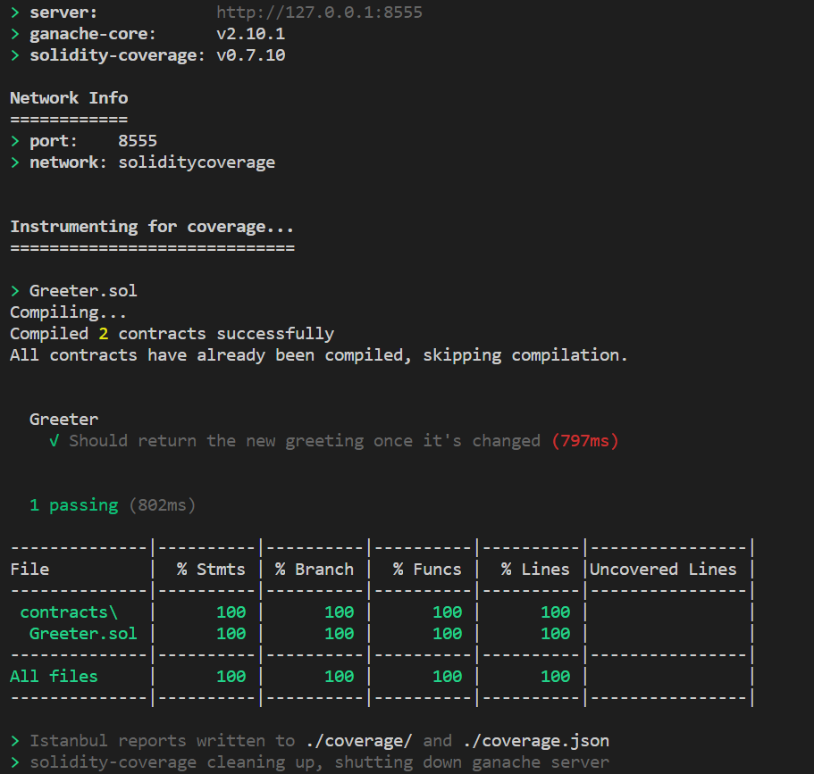

---
**External Plugin**

This is a third-party plugin. Please report issues in its [Github Repository](https://github.com/sc-forks/solidity-coverage/tree/master/BUIDLER_README.md).

---

# Running tests with solidity-coverage

We recommend using the built-in [Buidler EVM](../buidler-evm/README.md) network to test your
smart contracts, as it generates [combined JavaScript and Solidity stack traces](../buidler-evm/README.md#solidity-stack-traces),
making debugging easier.

If you still want to run your tests using solidity-coverage, you can do so with the `solidity-coverage` plugin for Buidler.

## Using the `solidity-coverage` plugin

This plugin adds a task called `coverage` that runs the tests in the `test/` directory with `solidity-coverage`.

To use it, you have to install it with `npm`

```
npm install --save-dev solidity-coverage
```

and add this line to your `buidler.config.js`

```js
usePlugin("solidity-coverage");

module.exports = {
  networks: {
    coverage: {
      url: 'http://localhost:8555'
    }
  },
}
```

Finally, you can run your tests with
 
```
npx buidler coverage
```

The below is the output of running this command with the sample tests that Buidler generates.



---
**Further Configuration**

If you would like to run test files that are outside of the `test/` directory or customize the configuration of the `solidity-coverage` plugin, check out the more in-depth documentation [here](https://buidler.dev/plugins/solidity-coverage.html).

---