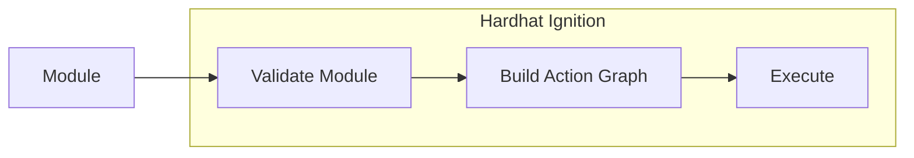

# Explanation

**Hardhat Ignition** is an infrastructure-as-code system to both deploy and, in the future, distribute smart contract systems.

When working with **Hardhat Ignition** you define how your smart contracts should be deployed, and let it be in charge of the execution. This means that **Hardhat Ignition** will be responsible for sending your transactions, managing gas, handling errors and restarts, and other situations that can appear when deploying a complex system.

**Hardhat Ignition** will support your deployment with: planning tools, visualisations of the running deployment and the capability to restart partial or failed deployments.

Specifying a deployment through **Hardhat Ignition** provides the option to leverage that specification in **Hardhat** tests, simplifying test setup. It is a goal of **Hardhat Ignition** to enable the distribution of deployments to allow Solidity developers to quickly create complex on-chain scenarios in their tests, that are not possible through forking tests (e.g. testing your contract's interaction with [Maker during an emergency shutdown](https://docs.makerdao.com/smart-contract-modules/shutdown)).

_**NOTE**: The current beta release focuses on deploying your local contracts, and not on distributing them._

## Understanding the Module API

**Hardhat Ignition** achieves a separation of _what is to be deployed_ from _how it will be deployed_ through a `Future`-orientated declarative API called the **Module API**. In contrast to the procedural approach used in most deployment scripts, a declarative API allows **Hardhat Ignition** to statically analyse a deployment without running it. That analysis supports: improved validation, resuming partial deployments and efficient grouping and processing of transactions.

### What is a Module?

Deployments in **Hardhat Ignition** are organized by modules. A module is a set of related smart contracts to be deployed and, potentially, contract calls that need to be run on them (e.g. calling an `initialize()` function).

A module is built by calling the `buildModule` function and passing it a unique name and a callback, the `moduleDefinition`. A common pattern is building one module per file and exporting it.

```tsx
module.exports = buildModule("CounterModule", (m) => {
  const initialCounterValue = 123;

  const counter = m.contract("Counter", [initialCounterValue]);

  return { counter };
});
```

The `moduleDefinition` callback receives a `moduleBuilder` object, which is used to define the different on-chain `Actions` that are needed to complete the deployment of the module. The module returns the contracts it wants to export.

`moduleBuilder` methods don’t execute any `Action`, they record the intent, its relationship to other `Actions` and return a `Future` that represents the eventual result of its execution.

In the above example, when we call `m.contract`, we create a contract deployment `Action`, and get a `Future` that represents its eventual result, the address the contract is deployed to.

`Actions` can depend on other `Action`'s results. We do this by using an `Action`'s `Future` as an argument to a subsequent `moduleBuilder` method. For example, here we define two `Actions`. One that deploys a contract, and another one that initializes it.

```tsx
module.exports = buildModule("ContractWithInitModule", (m) => {
  const c = m.contract("ContractWithInit");

  m.call(c, "init", [123]);

  return { c };
});
```

You can create complex graphs of `Actions` like this.

## How modules get executed

Deploying a module goes through several stages:



**Hardhat Ignition** first runs validation checks on the module to increase the likelyhood that it will execute on-chain (e.g. that all contract calls match methods available on the contract's abi).

A valid module is then analysed to build a graph of `Actions` to be executed. Tracing the flow of `Futures` between `Actions` in the module allows **Hardhat Ignition** to understand each `Action`'s dependencies, which in turn will control the order of execution.

The graph of `Actions` is then run by **Hardhat Ignition**'s execution engine, which proceeds through the dependencies of the graph, batching those `Actions` without dependencies or whose dependencies have been included in a previous batch. `Actions` in a batch are run in parallel.

Most actions get executed by submitting a transaction; though not every action results in a transaction. An action may lead to the submission of multiple transactions because of errors or gas management. The retrying of transactions is handled by the execution engine and is transparent to the user.

Executing an `Action` successfully _resolves_ its associated `Future`. Because an action is not run until all its dependencies have completed, any `Futures` it depends upon will have been resolved to an appropriate value before it is run (e.g. the address of a newly deployed contract).

The execution is complete when all actions have been run successfully.

### Handling errors and restarting

**Hardhat Ignition** keeps a journal of the execution. When a deployment fails, you can rerun the deployment. **Hardhat Ignition** will rebuild the previous state based on the journal, and will retry the failed transaction and proceed from there. Previous successful `Actions` will not be resubmitted.

### Modifying your Modules between deployments

You can modify your deployments between **Hardhat Ignition** runs, for instance, when dealing with errors. This allows you to incrementally grow your system.

**Hardhat Ignition** will reconcile your modified Module with the `Actions` that are recorded in the journal from previous runs. If it determines that an `Action` has already been run, then it will not be rerun. If the Module has diverged too far for **Hardhat Ignition** to safely make an assessment of whether an `Action` has been previously run, then it will alert the user.

You can explicitly force **Hardhat Ignition** to run an `Action` that failed or timed out in a previous run by using the `wipe` task. This will wipe clear the recorded state of that `Action` allowing it to rerun.

The tracking and reconciling of `Actions` in previous runs is done automatically, but you can identify an `Action` explicity with an `id` to eliminate ambiguity.

Next, dig deeper into defining modules:

[Creating modules for deployment](./creating-modules-for-deployment.md)
