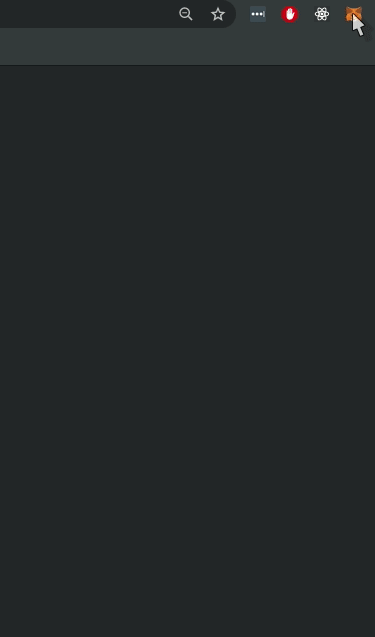
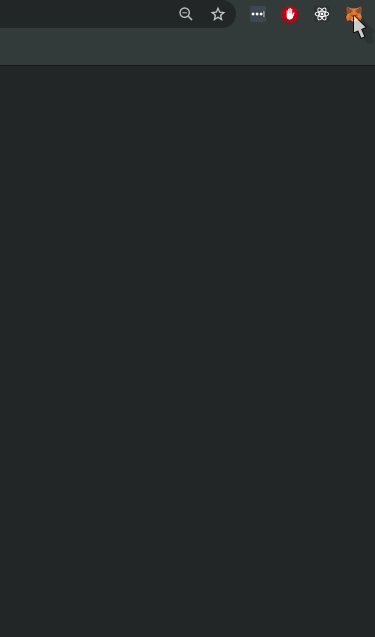

# 8. Creating a frontend (dapp)

We already created, tested and deployed a smart contract. If you were to deploy to Main Net, anyone with some advanced technical knowledge should be able to interact with your contract. But since we want to bring everyone into Ethereum, there should be interfaces simplifying the technical work.

Metamask is a browser extension that connects users and applications (dapps) with Ethereum. It does so by injecting an Ethereum `Provider` into the browser. This `Provider` serves as a bridge between dapps and Ethereum being the users the ones in control of what happens in between (a.k.a signing transactions).

Metamask allows the user to connect to different networks such as Main Net, Rinkeby, Ropsten or even localhost. We will take advantage of this feature and connect Metamask to our localhost provided by **Buidler EVM**. But first, lest's start creating the frontend.

## Setting up a React App
React has proven to be a relatively easy learning curve for many developers and also one of the most popular libraries for frontend development. We choose [Facebook's Create React App](https://github.com/facebook/create-react-app) to avoid any kind of build configuration problem and get to the basics of building a dapp as soon as possible.

Open a terminal on your project root directory and run `npx create-react-app frontend`. This command will create a new React app inside a folder named `frontend` (you should see this folder alongside `contracts` and `test`), it might take a couple of minutes.

```
npx create-react-app frontend
```

After installation ends, run `cd frontend` and `npm install --save bootstrap`. This will install Bootstrap for some basic styling. Finally, run `npm start`. If everything went well, your app should be available on `http://localhost:3000`.

```
cd frontend
npm install --save bootstrap
npm start
```

## Deploying to `localhost`
On the previous section we learned how to deploy contracts to different networks. For this part of the tutorial we will need to deploy to `localhost`. `localhost` is a local testing network powered by **Buidler EVM**. It comes with all the features provided by **Buidler EVM** but unlike `buidlerevm` network, it keeps running on the background. 

Create a new file named `deploy-frontend.js` inside the `/scripts` folder. 

```
touch scripts/deploy-frontend.js
```

Copy and paste the code below: 

```js
const fs = require("fs");

async function main() {
  if (network.name === "buidlerevm") {
    throw new Error(
      `You are trying to deploy a contract to the **Buidler EVM** network, which gets automatically created and destroyed every time. Use the Buidler option '--network localhost'`
    );
  }

  const [deployer] = await ethers.getSigners();
  console.log(
    "Deploying the contracts with the account:",
    await deployer.getAddress()
  );
  
  console.log("Account balance:", (await deployer.getBalance()).toString());

  const Token = await ethers.getContractFactory("Token");
  const token = await Token.deploy();

  console.log("Token address:", token.address);

  const dir = __dirname + "/../frontend/src/contracts";

  if (!fs.existsSync(dir)) {
      fs.mkdirSync(dir);
  }

  fs.writeFileSync(
    dir + "/contract-address.json", 
    JSON.stringify({ Token: token.address }, undefined, 2)
  );

  fs.copyFile(
    __dirname + "/../artifacts/Token.json", 
    dir + "/Token.json", (err) => {
      if (err) throw err;
  });
}

main()
  .then(() => process.exit(0))
  .catch(error => {
    console.error(error);
    process.exit(1);
  });
```

Go to the projects root folder and run `npx buidler node`.

```
$ npx buidler node
Started HTTP and WebSocket JSON-RPC server at http://127.0.0.1:8545/

Accounts
========
Account #0: 0xc783df8a850f42e7f7e57013759c285caa701eb6 (10000 ETH)
Private Key: 0xc5e8f61d1ab959b397eecc0a37a6517b8e67a0e7cf1f4bce5591f3ed80199122
...
```

Then open a new terminal on your project's root and deploy `Token.sol`:

```
npx buidler run scripts/deploy-frontend.js --network localhost
```

::: warning
If you change and recompile your contract, you will need to restart the network and re-run the script.
:::

## Setting up Metamask
In case you don't have Metamask installed, [follow this link](https://metamask.io/download.html). When installation completes, open Metamask and follow the instructions to create a new wallet.

### Connecting Metamask to Buidler EVM
Open Metamask and click on *Main Ethereum Network*, a list of networks should be displayed. Select *Localhost 8545*, it should connect to the local node of **Buidler EVM** that we already started by running `npx buidler node`.



Your wallet comes with a default account but Metamask allows you to import external accounts by using their private key. Open Metamask and click on your account (top right circle). Select "Import Account" and use any of the private keys provided by `npx buidler node`. If import succeed, you will see a balance of 10.000 ETH.




::: tip
You can switch between networks on Metamask and keep using the same accounts. Try switching to Ropsten and observe how the imported account balance change. Be aware of never putting real Ether into test accounts.
:::

## Putting it all together
Open `frontend/src/App.js` with your IDE and replace its content with the following code, we will explain the most important parts below.

```jsx
import React, { useState, useEffect } from 'react';
import { ethers } from 'ethers';

import 'bootstrap/dist/css/bootstrap.css';

import TokenArtifact from './contracts/Token.json';
import contractAddress from './contracts/contract-address.json';

let _provider, _token;

function Dapp() {

  /* Hooks */

  const [selectedAddress, setSelectedAddress] = useState(null);
  const [balance, setBalance] = useState(0);
  const [balanceOf, setBalanceOf] = useState(null);
  const [tokenData, setTokenData] = useState(null);
  const [loading, setLoading] = useState(false);
  const [initialized, setInitialized] = useState(false);

  useEffect(function() {
    // Check if wallet has been unlocked or the selected address changed
    const interval = setInterval(() => {
      setInitialized(true);
      if (
        window.ethereum === undefined || 
        window.ethereum.selectedAddress === selectedAddress
      ) {
        return true;
      }
      // Initialize ethers
      _provider = new ethers.providers.Web3Provider(window.ethereum);
      _token = new ethers.Contract(
        contractAddress.Token,
        TokenArtifact.abi,
        _provider.getSigner(0)
      );
      // Get Token data
      getTokenData();
      // Save wallet selected address
      setSelectedAddress(window.ethereum.selectedAddress);
      // Update selected address balance
      if (window.ethereum.selectedAddress) {
        updateBalance(window.ethereum.selectedAddress);
      }
    }, 1000);
    // The interval is cleared if selectedAddress change
    return () => clearInterval(interval);
  }, [selectedAddress]);

 /* Functions */

  // Updates the selected address balance 
  async function updateBalance(_address) {
    if (_address === undefined && selectedAddress) {
      _address = selectedAddress;
    }
    setLoading(true);
    const balance = await _token.balanceOf(_address);
    setBalance(balance.toString());
    setLoading(false);
  }

  // Get Token contract data
  async function getTokenData() {
    setLoading(true);
    const name = await _token.name();
    const symbol = await _token.symbol();
    setTokenData({
      name: name,
      symbol: symbol
    }); 
    setLoading(false);
  }

  // Transfer tokens from the selected address to any account
  async function transferTokens(event) {
    event.preventDefault();
    setLoading(true);
    const data = new FormData(event.target);
    if (data.get('to') && data.get('amount')) {
      try {
        const tx = await _token.transfer(data.get('to'), data.get('amount'));
        updateBalance();
      } catch (error) {
        console.error(error);
      }
    }
    setLoading(false);
  }

  // Get the balance of tokens of any account
  async function getBalanceOf(event) {
    event.preventDefault();
    setLoading(true);
    const data = new FormData(event.target);
    if (data.get('account')) {
      try {
        const res = await _token.balanceOf(data.get('account'));
        setBalanceOf({
          account: data.get('account'),
          balance: res.toString()
        });
      } catch (error) {
        console.error(error);
      }
    }
    setLoading(false);
  }


  /* Components */
  
  function NoWalletDetected() {
    return (
      <div className="container">
        <div className="row justify-content-md-center">
          <div className="col-6 p-4 text-center">
            <p>
              No Ethereum wallet was detected. <br/>
              Please install <a href="http://metamask.io" target="_blank">MetaMask</a>.
            </p>
          </div>
        </div>
      </div>
    );
  }

  function UnlockWallet() {
    if (!initialized) {
      return (
        <div className="container">
          <div className="row justify-content-md-center">
            <div className="col-6 p-4 text-center">
              <p>Trying to unlock your wallet...</p>
            </div>
          </div>
        </div>
      );
    }

    return (
      <div className="container">
        <div className="row justify-content-md-center">
          <div className="col-6 p-4 text-center">
            <p>Please unlock your wallet.</p>
            <button 
              className="btn btn-warning" 
              type="button" 
              onClick={() => window.ethereum.enable()}
            >
              Unlock
            </button>
          </div>
        </div>
      </div>
    );
  }

  function Loading() {
    if (!loading) {
      return null;
    }
    return (
      <div style={{ 
        position: "fixed", zIndex: 2, top: 0,left: 0,
        width: "100%", height: "100%",
        background: "rgba(255, 255, 255, 0.5)"        
      }}>
        <p style={{
          position: "absolute", zIndex: 3, top: "50%", left: "50%",
          width: "100px", height: "50px",
          marginLeft: "-50px", marginTop:" -25px",
          textAlign: "center"
        }}>
          <div className="spinner-border" role="status">
            <span className="sr-only">Loading...</span>
          </div>
        </p>
      </div>
    );
  }

  function Transfer() {
    if (!balance) {
      return <p>You don't have tokens to transfer</p>;
    }
    return (
      <div>
        <h4>Transfer</h4>
        <form onSubmit={transferTokens}>
          <div className="form-group">
            <label>Amount of {tokenData.symbol}</label>
            <input 
              className="form-control" 
              type="number" 
              step="1" 
              name="amount" 
              max={balance} 
              placeholder="1"
            />
          </div>
          <div className="form-group"> 
            <label>Recipient address</label>
            <input 
              className="form-control" 
              type="text" 
              name="to"
              placeholder={selectedAddress}
            />
          </div>
          <div className="form-group">
            <input className="btn btn-primary" type="submit" value="Transfer"/>
          </div>
        </form>
      </div>
    );
  }

  function BalanceOf() {
    let result;
    if (balanceOf) {
      result = (
        <p>
          Account <b>{balanceOf.account}</b> has {" "}
          <b>{balanceOf.balance} {tokenData.symbol}.</b>
        </p>
      );
    } 
    return (
      <div>
        <h4>Balance</h4>
        <form onSubmit={getBalanceOf}>
          <label>Get the balance of {tokenData.symbol} of any account</label>
          <div className="form-group">
            <input 
              className="form-control" 
              type="text" 
              name="account" 
              placeholder={selectedAddress} 
            />
          </div>
          <div className="form-group">
            <input className="btn btn-primary" type="submit" value="Submit"/>
          </div>
        </form>
        {result}
      </div>
    );
  }


  /* Render */

  if (window.ethereum === undefined) {
    return NoWalletDetected();
  }

  if (!selectedAddress) {
    return UnlockWallet();
  }

  if (!tokenData) {
    return <Loading />;
  }

  return (
    <div className="container p-4">
      <Loading />
      <h1>{tokenData.name} ({tokenData.symbol})</h1>
      <p>
        Welcome <b>{selectedAddress}</b>, {" "}
        you have <b>{balance} {tokenData.symbol}</b>.
      </p>
      <hr/>
      <div className="row">
        <div className="col-6">
          <Transfer />
        </div>
        <div className="col-6">
          <BalanceOf />
        </div>
      </div>
    </div>
  );
}

export default Dapp;
```

### Base Layout
We decided to put everything into a single file in order to make things simpler. The file is divided into four major sections: Hooks, Transactions, Components and Render.

### Hooks
The first part of Hooks just defines some state variables using the `useState` hook. The second part uses the `useEffect` hook in order to trigger an interval that checks if a wallet has been unlocked. Some important things to notice here:

```jsx
if (
  window.ethereum === undefined || 
  window.ethereum.selectedAddress === selectedAddress
) {
  return true;
}
```

As we mentioned before, Metamask injects an Ethereum `Provider` into the browser by storing it inside `window.ethereum`. As this `Provider` comes locked by default, we need to check if it has been unlocked. One common way of doing this is by reading `window.ethereum.selectedAddress` as it is used to store the active wallet account.

Second, if the `Provider` has been unlocked, `ethers` is initialized:

```jsx
_provider = new ethers.providers.Web3Provider(window.ethereum);
_token = new ethers.Contract(
  contractAddress.Token,
  TokenArtifact.abi,
  _provider.getSigner(0)
);
```

With that instance of ethers, we get the first `Signer`, which will be associated to the wallet. Any transaction sent to the Token contract will go through this account. If the transaction has a gas cost associated, then the wallet will prompt the user to pay for it.

### Transactions
Transactions must be defined as `async` functions. In a production environment (such as Main Net), transactions might take several seconds to get mined, sometimes minutes or even hours. In the context of Buidler EVM, transactions go through almost immediately, so we don't need to worry about this. Just remember to let your users know that something is happening on the background.

Some transactions are gas-free, just like the function below:

```jsx
async function updateBalance(_address) {
  if (_address === undefined && selectedAddress) {
    _address = selectedAddress;
  }
  const balance = await _token.balanceOf(_address);
  setBalance(balance.toString());
}
```

Transactions that *write* on the blockchain (change the contract state) have an associated gas cost. In the example below, sending tokens to another account will change the contract state, therefore Metamask will prompt to sign it before going through.

```jsx
async function transferTokens(event) {
  event.preventDefault();
  const data = new FormData(event.target);
  if (data.get('to') && data.get('amount')) {
    try {
      const tx = await _token.transfer(data.get('to'), data.get('amount'));
      updateBalance();
    } catch (error) {
      console.error(error);
    }
  }
}
```

::: warning
Note that some numeric values are represented with Big Numbers, and they can't be rendered directly. Calling `toString()` method on those variables will do the trick and print them as formated numbers. 
:::


### Components and Render
Most code below these section is specific for the dapp we are building. But there is one thing worth mention. Before rendering our dapp, we must check whether a wallet has been unlocked or if it is even present. If a wallet is present but has not been unlocked yet, we must simple call `window.ethereum.enable()`. The user will be prompted to allow the connection:

```jsx
<p>Please unlock your wallet.</p>
<button 
  className="btn btn-warning" 
  type="button" 
  onClick={() => window.ethereum.enable()}
>
  Unlock
</button>
);
```
